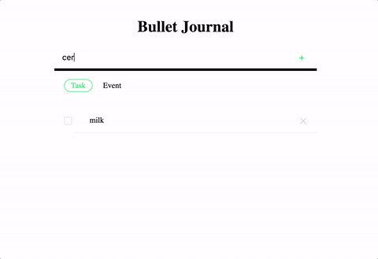

# To Do List Bullet Journal (vanilla JS)

Simple To Do list (Bullet Journal style). No frontend framework just plain vanilla JS.

[Deployed Site](https://todobulletjournal.herokuapp.com/)



## Features
* Add todo
* Categorize task as 'task' or an 'event'
* Complete todo's
* Remove todo's

### Future Features
* Filter active, completed, all todo's
* Remove all completed todo's
* Drag and reorder todo's

## Getting Started
These instructions will get you a copy of the project up and run on your local machine. 

### Prerequisites

##### Node
For development, you will only need [Node.js](http://nodejs.org/) installed on your environment. 

### Installing

```sh
$ git clone https://github.com/whitzhu/todo-bulletjournal-vanillaJS
$ cd todo-bulletjournal-vanillaJS
$ npm install
```

### Run Server

```
npm start
```

## Built With

* [HTML5](https://www.w3.org/TR/html5/) - Front end markup language
* [CSS3](http://www.css3.info/) - Styling
* [JS](https://developer.mozilla.org/en-US/docs/Web/JavaScript) - Scripting language
* [Express](https://expressjs.com/) - Server Framework
* [Node](https://nodejs.org/) - Server

## Acknowledgments

* Designed by Whitney Zhu - [Portfolio](https://www.behance.net/whitzhu)
